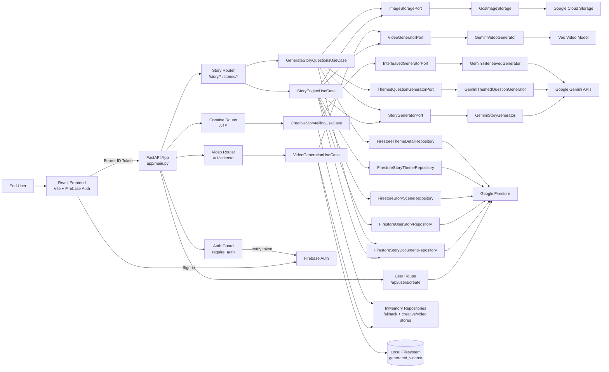
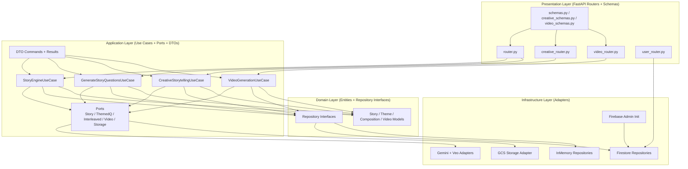

# Nebula Architecture Diagram

This diagram is generated from the current code under `backend/app/*`, including existing video capabilities and the planned audio output path.

## 1) Whole Application Architecture (Current + Near-Term)



## 2) Backend Internal Layering (Hexagonal Style)



## 3) Media Output Pipeline (Image + Video Today, Audio Planned)

```mermaid
flowchart LR
  S[Story Opening / Composition Request]
  ORCH[Use Case Orchestrator<br/>StoryEngine / CreativeStorytelling]
  TRACK[MediaTaskTracker]

  IMG[Image Generation<br/>Gemini + GCS upload]
  VID[Video Generation<br/>Veo + GCS/local storage]
  AUD[Audio Generation (Planned)<br/>TTS/Audio model + storage]

  META[Firestore Scene/Story Metadata<br/>imageUrl/videoUrl/audioUrl]
  FE[Frontend Poll/Fetch<br/>/story/media + composition endpoints]

  S --> ORCH
  ORCH --> TRACK

  ORCH --> IMG
  ORCH --> VID
  ORCH -. planned .-> AUD

  IMG --> META
  VID --> META
  AUD -. planned .-> META

  META --> FE
```

## Notes

- Current code already supports:
  - Story generation and branching metadata
  - Question generation with generated option images
  - Video job generation (`/v1/videos`)
  - Interleaved composition with `audio` and `video` part types represented in domain models (audio currently queued/placeholder in generator path)
- Current persistence mix:
  - Firestore for story/theme/user data (when configured)
  - In-memory repositories as fallback or for creative/video store in current implementation
  - Local filesystem output for video jobs under `generated_videos/`
