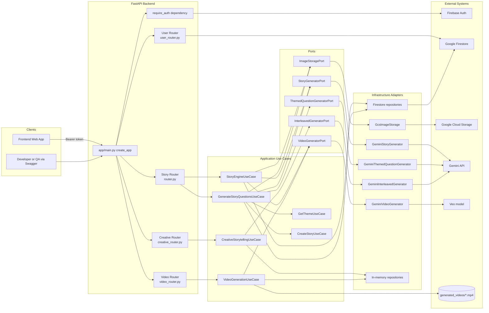
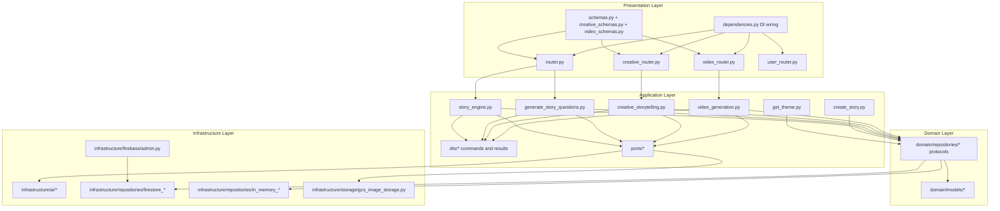
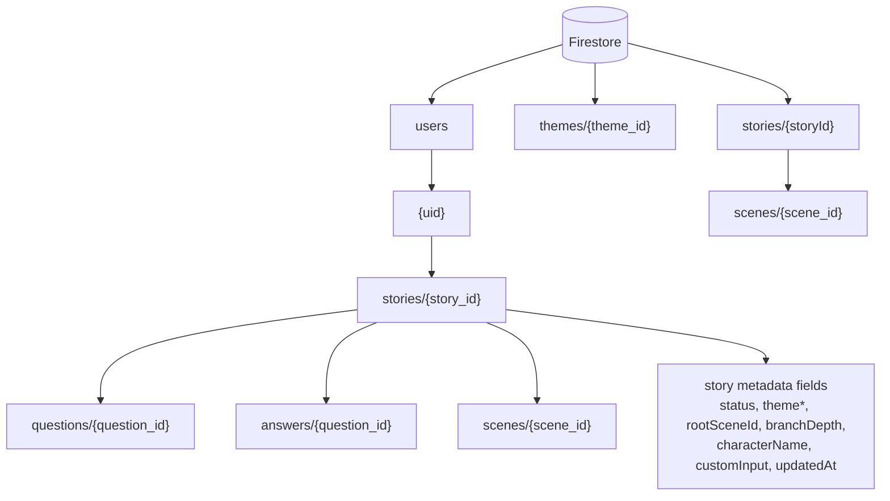
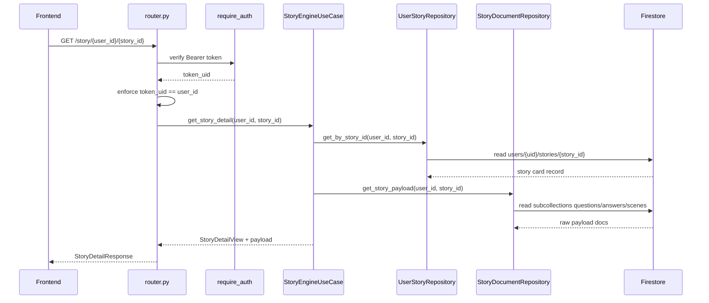

# Nebula Backend Architecture

Generated from current backend code (`backend/app/*`) on `main`.

## 1) Backend Runtime Architecture

## 2) Internal Layering (Hexagonal)

## 3) Firestore Data Model Used by Story Endpoints

## 4) Sequence: `GET /story/{user_id}/{story_id}`

This endpoint returns story metadata plus raw `questions`, `answers`, and `scenes`.

## Current Media Status

- Story flow supports image and video asset URLs per choice (`/story/media/{story_id}/{scene_id}`).
- Dedicated video generation exists at `/v1/videos/*` and writes output to `generated_videos/`.
- Creative composition supports requested modalities including `audio` and `video`; current interleaved generator emits queued placeholders for modalities not directly generated in-line.
